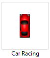
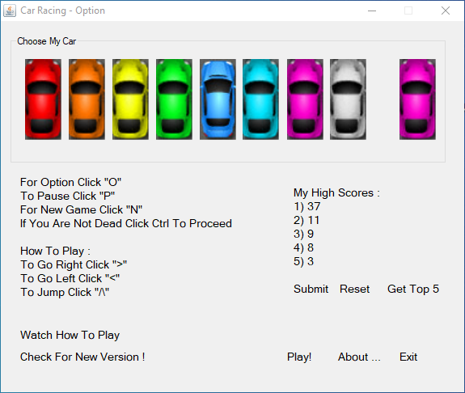
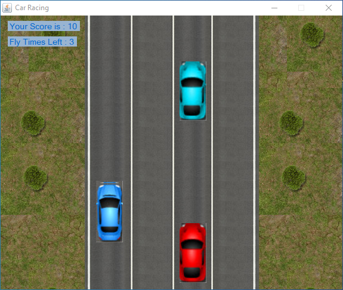
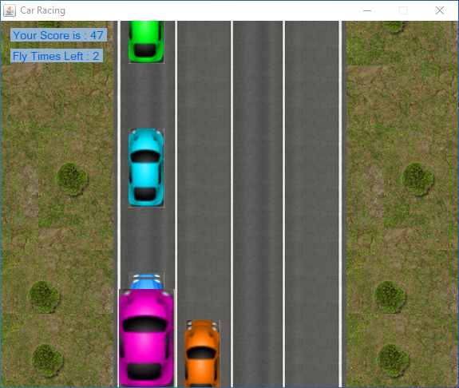
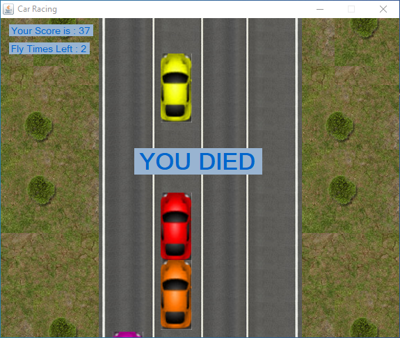
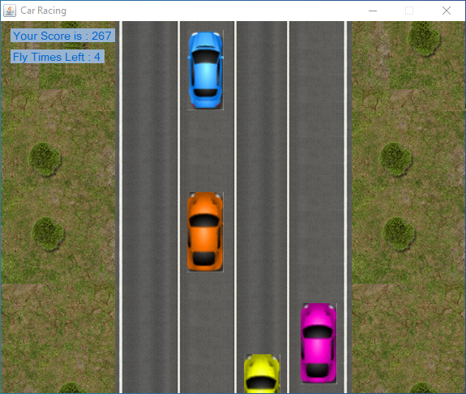
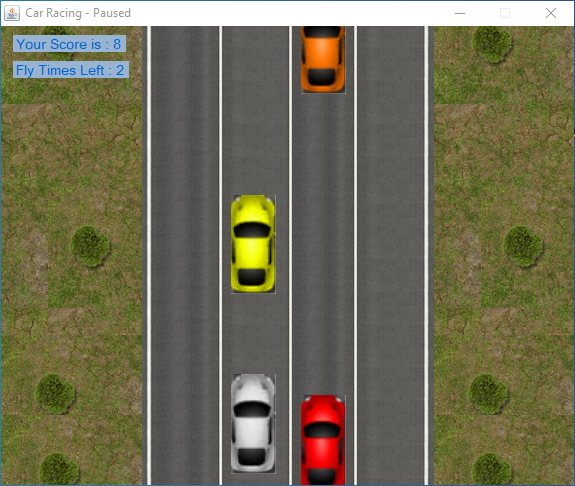

Car Racing
```
A windows application game made with VB.
Control your car and avoid crashing into other cars.
You lose when your car touches another car.
You can use the jump power-up to avoid crashing.
You get 1 jump power up every 20 points.

The demo is a script controlling the car using if statements.
```
<center>
	 
</center>

ScreenShots
<table>
	<tr>
  	<td>  </td>
  	<td>  </td>
  	<td>  </td>
	</tr>
	<tr>
	  <td><b> options </b></td>
		<td><b> gameplay </b></td>
		<td><b> jumping </b></td> 
	</tr>
	<tr>
  	<td>  </td>
  	<td>  </td>
  	<td>  </td>
	</tr>
	<tr>
	  <td><b> lose </b></td>
		<td><b> demo </b></td>
		<td><b> paused </b></td> 
	</tr>
</table>
